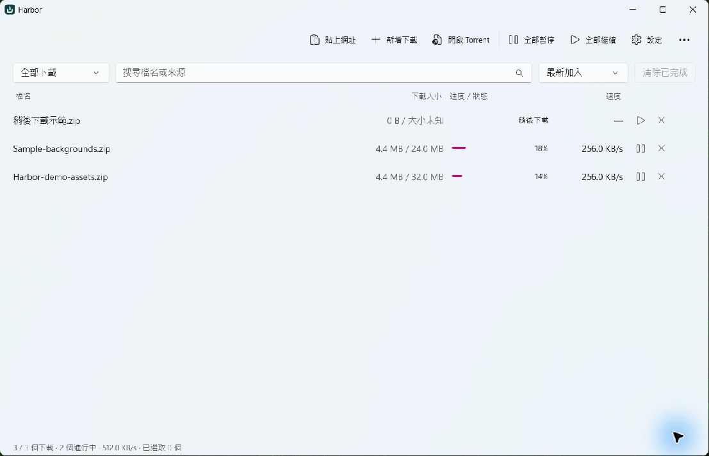

# Harbor


Windows 原生下載管理員。使用 WinUI 3 介面與 [Gopeed](https://github.com/GopeedLab/gopeed) 下載引擎，支援繁體中文、English、简体中文，提供瀏覽器下載接管、稍後下載與定時開始。

Harbor fork 自 Gopeed，是社群維護的獨立專案，並非 Gopeed 官方發行版。



畫面為 0.7.0 操作示範；0.8.0 的工具列與設定已重新整理。

[觀看操作示範](https://github.com/tavricccc/harbor/releases/download/v0.7.0/Harbor-demo.mp4)

## 下載

**[下載 Harbor 0.8.0](https://github.com/tavricccc/harbor/releases/tag/v0.8.0)** · Windows x64 預覽版

| 檔案 | 用途 |
| --- | --- |
| [安裝版](https://github.com/tavricccc/harbor/releases/download/v0.8.0/Harbor-Setup-0.8.0-x64.exe) | 一般使用者選這個。包含執行環境，安裝到使用者目錄，不需管理員權限。 |
| [完整原始碼](https://github.com/tavricccc/harbor/releases/download/v0.8.0/Harbor-Source-0.8.0.zip) | 包含此版本使用的 Gopeed 核心。 |
| [SHA-256](https://github.com/tavricccc/harbor/releases/download/v0.8.0/SHA256SUMS.txt) | 下載檔案校驗碼。 |

支援 Windows 10 1809 以上及 Windows 11；建議 Windows 11。Windows 10 尚未完成實機驗證。從舊版直接執行安裝包即可升級，任務、設定與下載檔案會保留。

## 功能

- HTTP／HTTPS 多連線下載、暫停與中斷續傳。
- BitTorrent、magnet 與 eD2k；Torrent 支援挑選內含檔案。
- Gopeed 官方瀏覽器擴充套件接管下載。
- 多行連結批次加入、搜尋、排序與多選操作。
- 稍後下載及一次性的開始排程。
- 下載分類、代理設定與 Gopeed 擴充功能。
- 隨 Windows 切換明暗主題，關閉主視窗後可繼續下載。
- 0.9.0 起可跟隨 Windows 語言，或在「設定 → 介面 → 語言」選擇繁體中文、英文、簡體中文；儲存後關閉所有 Harbor 視窗並重新開啟套用。

目前排程需背景核心運行；不會喚醒睡眠或關機的電腦。到期項目會在核心下次啟動時補執行。多個命名佇列、週期排程與全域限速尚未提供。

## 瀏覽器接管

先在要使用的瀏覽器安裝 **Gopeed 官方擴充套件**：

| Chrome | Edge | Firefox |
| --- | --- | --- |
| [Chrome Web Store](https://chromewebstore.google.com/detail/gopeed/mijpgljlfcapndmchhjffkpckknofcnd) | [Edge Add-ons](https://microsoftedge.microsoft.com/addons/detail/dkajnckekendchdleoaenoophcobooce) | [Firefox Add-ons](https://addons.mozilla.org/firefox/addon/gopeed-extension) |

1. 確認擴充套件已啟用。
2. 安裝 Harbor 即會自動註冊本機接管；啟動時也會補上缺少的註冊，不需手動啟用。
3. 在 Gopeed 擴充套件設定中關閉「遠端下載」，再嘗試下載一個檔案。出現 Harbor 確認視窗就表示接管生效。

本機接管不用填伺服器位址或 Token。詳細設定與排除問題見 [瀏覽器接管指南](docs/browser-integration.md)。

## 使用

按「貼上網址」或 Ctrl+V 加入連結；每行一個可批次加入。按「新增下載」可調整位置、檔名與分類，再選擇立即開始、稍後下載或排程。

Torrent 可從「更多」選單選取，也能拖進主視窗。清單右側操作隨狀態切換，下載中可暫停、失敗可重試，完成後可開啟檔案。選取下載後，工具列可批次繼續、暫停或移除；移除預設保留檔案。

雙擊或在清單按 Enter，會開啟進行中的下載進度或已完成檔案。HTTP／BitTorrent／eD2k 等設定放在可展開的選項中，下載確認的「下載選項」可調整這次下載。完整操作見 [使用指南](docs/usage.md)。

HTTP 來源失效時，可修改網址，或選「用下一次瀏覽器連結更新來源」接續原任務。

| 快捷鍵 | 操作 |
| --- | --- |
| Ctrl+N / Ctrl+V | 新增下載 / 貼上連結或 Torrent |
| Ctrl+F / F5 | 搜尋 / 重新整理 |
| Ctrl+A / Delete | 在清單全選 / 移除選取任務 |
| Enter | 在清單開啟進度或已完成檔案 |
| Ctrl+Enter / Esc | 在確認視窗檢查或開始 / 取消 |

## 資料與解除安裝

任務、設定與 API Token 放在 `%LOCALAPPDATA%\Harbor`。解除安裝會移除程式與整合註冊，保留任務資料和下載檔案。回報問題時，請勿附上 Token、Cookie 或私人下載連結。

## 建置

需要 Windows、PowerShell 7、Go 1.27 與 .NET 10 SDK。安裝包另需 Inno Setup 6。Go 會下載核心相依套件。

```powershell
git clone --branch winui-native https://github.com/tavricccc/harbor.git
cd harbor
pwsh -File scripts/build.ps1 -Test
pwsh -File scripts/package.ps1 -SkipBuild
pwsh -File scripts/source.ps1
```

`core/` 是背景服務；`src/Harbor/` 是 WinUI 前端。下載引擎直接引用官方 Gopeed Go module，版本與校驗碼由 `go.mod`／`go.sum` 管理。`core/upstream.json` 記錄對應的官方 release，建置時自動使用該版本名稱。

跟進上游版本時執行：

```powershell
pwsh -File scripts/update-core.ps1 -Channel preview -Test
```

`preview` 包含正式版及預覽版，目前用於 Gopeed 2.0；`stable` 只選正式版。完整更新與回復步驟見 [核心維護](docs/core-updates.md)，參與方式見 [CONTRIBUTING.md](CONTRIBUTING.md)。

模組劃分、效能測量與發行檢查見 [開發維護](docs/maintenance.md)。

## 致謝與授權

感謝 [GopeedLab 與 Gopeed 貢獻者](https://github.com/GopeedLab/gopeed/graphs/contributors)開源並持續維護下載引擎。Harbor 的核心能力建立在 Gopeed 之上；WinUI 3 介面另行實作。

依 [GPL-3.0](LICENSE) 發布，保留上游授權與來源。Release 附加的完整原始碼在 `third_party/gopeed/` 包含使用的官方核心來源，以及 release、module 版本與校驗碼。GitHub 自動產生的 Source code ZIP 可透過 Go 下載相依套件；要取得隨發行版附上的核心原始碼，請下載 Harbor-Source 附加檔。
